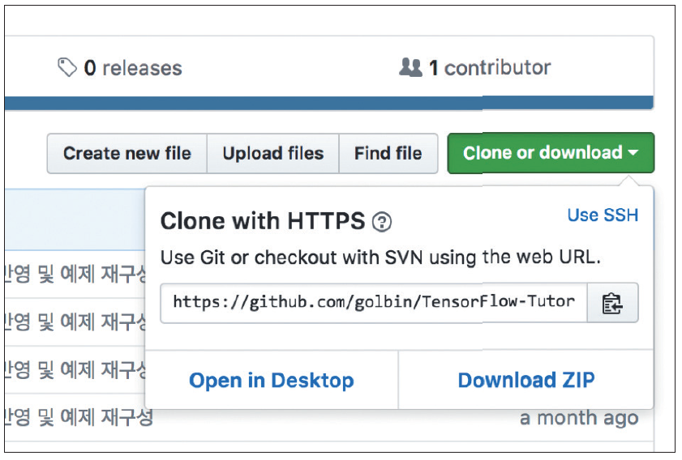
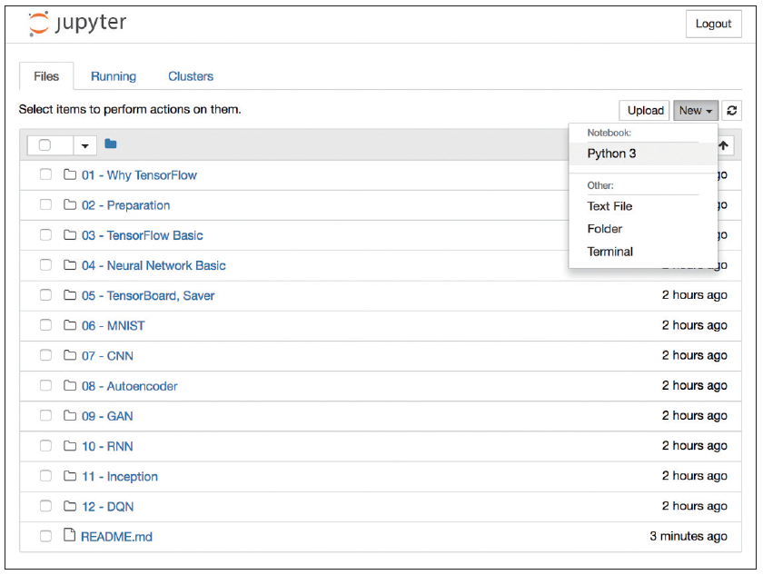
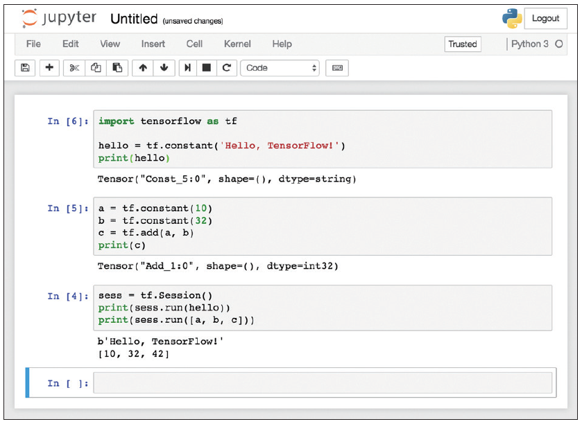

## 2장 텐서플로 설치와 주피터 노트북

이 책은 파이썬 또는 기타 프로그래밍 언어를 어느 정도 아는 분을 대상으로 썼습니다. 따라서 설치 방법을 자세하게 설명하기보다는 어떠한 설치 방법들이 있는지, 그리고 이 책의 예제를 실행하는 데 필요한 라이브러리 설치를 중심으로 설명하겠습니다.

### 2.1 파이썬 및 필수 라이브러리 설치하기
이 책의 예제는 파이썬 3.6 버전과 텐서플로 1.2 버전을 기준으로 썼습니다. 따라서 파이썬 3.6을 설치해야 합니다(윈도우에서는 반드시 파이썬 3.5 이상, 64비트용을 사용해야 합니다).

맥, 리눅스, 윈도우 사용자 모두 다음 주소에서 파이썬을 내려받아 설치할 수 있습니다.

* https://www.python.org/downloads/

파이썬을 잘 설치했다면 텐서플로 설치는 매우 쉽습니다. 다음처럼 맥과 리눅스의 터미널 또는 윈도우의 명령 프롬프트에서 pip3 명령어를 사용하면 됩니다.

```
C:\> pip3 install --upgrade tensorflow
```

만약 엔비디아 GPU를 사용하고 있다면, 엔비디아 사이트에서 CUDA 툴킷을 설치한 뒤 다음의 명령어로 쉽게 GPU 가속을 지원하는 텐서플로를 설치할 수 있습니다(CUDA 툴킷 문서 http://docs.nvidia.com/cuda 참조).

```
C:\> pip3 install --upgrade tensorflow-gpu
```

그런 다음 이 책에서 사용하는 라이브러리들을 설치합니다.

```
C:\> pip3 install numpy matplotlib pillow
```

* numpy - 수치 계산 라이브러리
* matplotlib - 그래프 출력 라이브러리
* pillow - 이미지 처리 라이브러리

이 외에 홈브루Homebrew, 아나콘다Anaconda 또는 소스를 직접 빌드해서 설치하는 다양한 방법이 있습니다. 설치가 잘 안 되거나 더 다양한 방법들을 알고 싶다면 다음의 텐서플로의 공식 홈페이지에서 확인하세요.

* https://www.tensorflow.org/install

### 2.2 텐서플로 예제 내려받고 실행해보기
이 책의 모든 예제는 깃허브 저장소 https://github.com/golbin/TensorFlow-Tutorials 에 올려뒀습니다. 다음의 git 명령어로 소스코드 전체를 내려받거나, 압축 파일을 내려받아 적당한 위치에 풀어둡니다.

```
C:\> git clone https://github.com/golbin/TensorFlow-Tutorials.git
```

**그림 2-1** 깃허브에서 예제 소스 압축 파일 내려받기


그런 다음 터미널이나 명령 프롬프트에서 TensorFlow-Tutorials / 03 - TensorFlow Basic 위치로 이동한 뒤 다음 명령어를 실행해 파이썬과 텐서플로가 잘 설치되었는지 확인해봅니다. 

```
C:\TensorFlow-Tutorials\03 - TensorFlow Basic> python3 "01 - Basic.py"
Tensor("Const:0", shape=(), dtype=string)
Tensor("Add:0", shape=(), dtype=int32)
b'Hello, TensorFlow!'
[10, 32, 42]
```

윈도우에서는 탐색기를 이용해 원하는 폴더로 이동한 뒤 Shift + 마우스 오른쪽 버튼을 누르면, ‘여기서 PowerShell 창 열기’라는 메뉴를 통해 쉽게 해당 폴더를 명령 프롬프트로 열 수 있습니다(구버전 윈도우에서는 ‘여기서 명령 창 열기’). 또한, 터미널이나 명령 프롬프트에서 파일명의 일부를 입력한 뒤 TAB 키를 누르면 파일 이름이 자동완성되니 참고해주세요.

> **NOTE:** 텐서플로 실행 시 다음과 같은 경고 메시지가 나올 수 있지만 텐서플로 실행에는 문제없으니 무시하셔도 됩니다.
>
>```
>2017-06-30 19:15:49.653301: W tensorflow/core/platform/cpu_feature_guard.cc:45] The TensorFlow library wasn't compiled to use SSE4.2 instructions, but these are available on your machine and could speed up CPU computations.
>2017-06-30 19:15:49.653322: W tensorflow/core/platform/cpu_feature_guard.cc:45] The TensorFlow library wasn't compiled to use AVX instructions, but these are available on your machine and could speed up CPU computations.
>```

이 메시지가 보기 싫다면 터미널에서 다음 명령어를 실행해 경고 메시지를 없앨 수 있습니다.

```
export TF_CPP_MIN_LOG_LEVEL=2 // 리눅스, 맥
set TF_CPP_MIN_LOG_LEVEL=2 // 윈도우
```

## 2.3 주피터 노트북
주피터 노트북Jupyter Notebook은 웹브라우저상에서 파이썬 코드를 단계적으로 쉽게 실행하고, 시각적으로 빠르게 확인해볼 수 있도록 해주는 프로그램입니다(다른 프로그래밍 언어도 지원합니다).

주피터 노트북의 설치와 사용법은 매우 간단합니다. 먼저 설치는 일반적인 파이썬 패키지와 같이 pip3를 이용하면 됩니다.

```
C:\> pip3 install jupyter
```

그런 다음 프로젝트를 진행할 폴더의 터미널 또는 명령 프롬프트에서 다음 명령을 실행합니다.

```
C:\> jupyter notebook
```

그러면 웹브라우저가 열리면서 주피터 노트북이 실행될 것입니다.

**그림 2-2** 주피터 노트북을 TensorFlow-Tutorials 저장소의 폴더에서 실행한 모습


주피터 노트북을 실행한 다음 오른쪽의 [New] -> [Python 3] 메뉴를 눌러 새 프로젝트를 만들 수 있습니다.

새 프로젝트가 생성된 뒤, 파이썬 코드들을 넣고 Shift + Enter를 치면 다음처럼 코드 조각들의 실행 결과를 쉽게 확인할 수 있습니다.

**그림 2-3** 주피터 노트북 사용 예


이처럼 주피터 노트북은 파이썬 코드를 반복해서 실행하고 중간중간 결과를 확인하기에 매우 좋은 프로그램입니다. 하지만 이 책은 기본적으로 명령 프롬프트에서 실행하는 것을 가정하므로 주피터 노트북에서는 실행되지 않는 경우도 있을 것입니다(그래프를 그리거나 실행이 오래 걸리는 경우 등). 이런 경우가 생기면 당황하지 말고 구글링을 하시면 쉽게 해결책을 찾을 수 있을 것입니다. 구글은 모든 엔지니어의 친구니까요.
