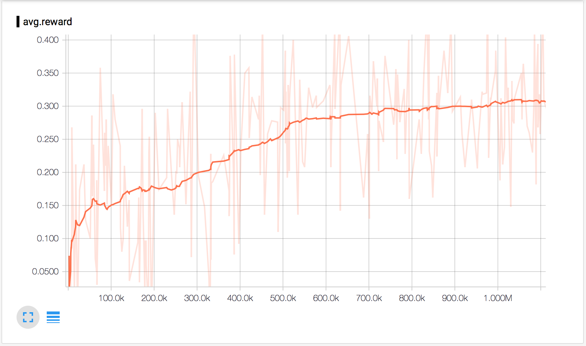

# Deep Q-network

- 구글의 딥마인드에서 개발한 Deep Q-network (DQN)을 이용하여 Q-learning 을 구현해봅니다.
- 딥마인드의 논문에서는 신경망 모델로 CNN 모델을 사용하지만, 여기서는 간단히 기본적인 다중 신경망 모델을 사용합니다.
- 게임은 간단한 장애물 피하기 게임이며 화면 출력은 matplotlib 으로 구현하였습니다.

### 파일 설명

- agent.py
  - 게임을 진행하거나 학습시키는 에이전트입니다.
- game.py
  - 게임을 구현해 놓은 파일입니다. 게임의 상태를 화면의 픽셀로 가져오지 않고, 좌표값을 이용하여 계산량을 줄이도록 하였습니다.
- model.py
  - DQN을 구현해 놓은 파일입니다.
  - 논문에서는 CNN 모델을 사용하였지만, 구현을 간단히 하고 성능을 빠르게 하기 위해 기본적인 신경망 모델을 사용합니다.

### 핵심 코드

게임 구현을 위한 다양한 내용들이 들어있어 코드분량이 꽤 많지만, 핵심 내용은 딱 다음과 같습니다.

1. Q_value 를 이용해 얻어온 액션을 수행하고, 해당 액션에 의한 게임의 상태와 리워드를 획득한 뒤, 이것을 메모리에 순차적으로 쌓아둡니다. (model.py/step 함수 참고)
2. 일정 수준 이상의 메모리가 쌓이면, 메모리에 저장된 것들 중 샘플링을 하여 논문의 수식을 이용해 다음처럼 최적화를 수행합니다.

```python
# model.py 내용을 간소하게 재구성했습니다.

def build_model(self):
    L1 = tf.nn.relu(tf.matmul(state, W1) + b1)
    Q_value = tf.matmul(L2, W3) + b3

    # DQN 의 손실 함수를 구성하는 부분입니다. 다음 수식을 참고하세요.
    # Perform a gradient descent step on (y_j-Q(ð_j,a_j;θ))^2
    Q_action = tf.reduce_sum(tf.mul(Q_value, self.input_action), axis=1)
    cost = tf.reduce_mean(tf.square(self.input_Y - Q_action))
    train_op = tf.train.AdamOptimizer(1e-6).minimize(cost, global_step=self.global_step)

def train(self):
    Q_value = self.Q_value.eval(feed_dict={self.input_state: next_state})

    # DQN 의 손실 함수에 사용할 핵심적인 값을 계산하는 부분입니다. 다음 수식을 참고하세요.
    # if episode is terminates at step j+1 then r_j
    # otherwise r_j + γ*max_a'Q(ð_(j+1),a';θ')
    for i in range(0, self.BATCH_SIZE):
        if minibatch[i][4]:
            Y.append(reward[i])
        else:
            Y.append(reward[i] + self.GAMMA * np.max(Q_value[i]))

    self.train_op.run(feed_dict={
        self.input_Y: Y,
        self.input_action: action,
        self.input_state: state
    })
```

### 결과물

- 상상력을 발휘해주세요. 검정색 배경은 도로, 사각형을 자동차들로 그리고 녹색 사각형을 자율 주행차라고 상상하고 즐겨주시면 감사하겠습니다. :-D
- 100만번 정도의 학습 후 최고의 성능을 내기 시작했으며, 2012 맥북프로 CPU 버전으로 최고 성능을 내는데까지 약 1시간 정도 걸렸습니다.




### 사용법

자가 학습시키기

```
python agent.py -train
```

얼마나 잘 하는지 확인해보기

```
python agent.py
```

텐서보드로 평균 보상값 확인해보기

```
tensorboard --logdir=./logs
```
