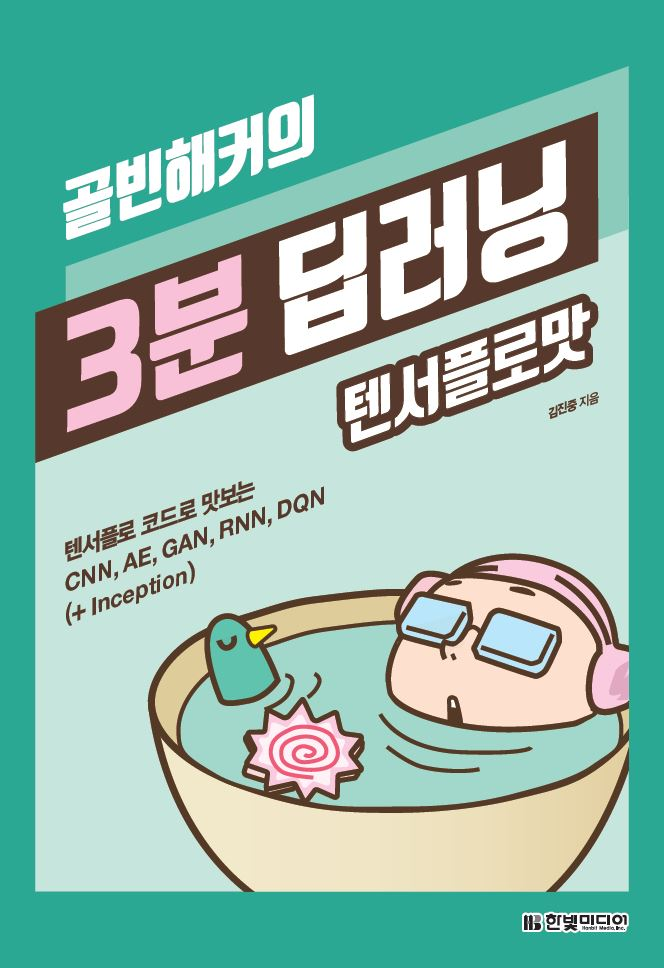

# TensorFlow Tutorials

텐서플로우를 기초부터 응용까지 단계별로 연습할 수 있는 소스 코드를 제공합니다.

텐서플로우 공식 사이트에서 제공하는 안내서의 대부분의 내용을 다루고 있으며,
공식 사이트에서 제공하는 소스 코드보다는 훨씬 간략하게 작성하였으므로 쉽게 개념을 익힐 수 있을 것 입니다.
또한, 모든 주석은 한글로(!) 되어 있습니다.

다만, 이론에 대한 깊은 이해와 정확한 구현보다는,
다양한 기법과 모델에 대한 기초적인 개념과 텐서플로우의 기본적인 사용법 학습에 촛점을 두었으므로,
구현이 미흡하게 되어 있는 부분이 많음을 고려해 주세요.

또한, 아름다운 코드를 만들기 보다는 순차적인 흐름으로 이해할 수 있도록 코드와 주석과 만들었음을 참고 해 주시면 감사하겠습니다.

## 요구사항

- TensorFlow >= 1.8.0
- Python >= 3.6.1
    - numpy >= 1.14.3
    - matplotlib >= 2.2.2
    - pillow >= 5.1

## 골빈해커의 3분 딥러닝

이 저장소에 관심을 가져주신 많은 분들 덕분에, 주석을 정리하고 설명을 더해 『골빈해커의 3분 딥러닝』(한빛미디어, 2017)이라는 이름으로 책을 내게 되었습니다.

이론을 깊이 파헤치기보다는 다양한 딥러닝 모델의 기초 개념과 기본적인 텐서플로 사용법을 학습하는 데 초점을 두었습니다. 따라서 딥러닝/머신러닝을 처음 접하시는 개발자분들에게 특히 도움이 되리라 생각합니다.

물론, 장식용으로는 더욱 좋습니다. ^_^b

### 구매하기

[예스24](http://www.yes24.com/24/goods/49853812?scode=032&OzSrank=1) | [교보문고](http://www.kyobobook.co.kr/product/detailViewKor.laf?ejkGb=KOR&mallGb=KOR&barcode=9791162240137&orderClick=LAG&Kc=) | [알라딘](http://www.aladin.co.kr/shop/wproduct.aspx?ItemId=118302430)

### 추천사

딥러닝을 공부하는 입장에서 꽤 많은 원서와 국내 번역서와 자료를 읽어보았지만, 핵심을 이렇게 간결하게 실용적으로 잘 풀어놓은 자료를 본 적이 없습니다. 다른 서적들이 보통 CNN 모델 설명까지만 머무르는데 반해 이 책은 RNN, DQN, 오토인코더까지 주요한 딥러닝 모델을 실용적인 예제로 접근하기 때문에 딥러닝을 공부하는 사람들에게 좋은 방향을 제시해줍니다. 딥러닝을 시작하는 사람이라면 반드시 책꽂이에 한 권쯤 꽂혀 있어야하는 책이라고 강력하게 추천합니다.

_조병욱(조대협), 구글코리아 클라우드 엔지니어 ​『(조대협의 서버 사이드) 대용량 아키텍처와 성능 튜닝』 저자_

---

“인공지능은 새 시대의 전기다.” 딥러닝의 세계 최고 권위자 앤드류 응 박사는 바이두를 떠나며 AI의 미래가치를 이렇게 표현했습니다. AI는 더 이상 소수의 과학자를 위한 연구가 아니라 전기처럼 일상에서 누구나 편하게 사용할 수 있는 기술로 다가왔다는 얘기입니다. 실제로 이 책은 AI의 핵심인 딥러닝이 누구나 편하게 사용할 수 있는 전기와 같은 기술이란 걸 잘 설명합니다. 이미지 인식의 은총알인 CNN, 2016년 가장 뜨거운 감자였던 GAN, 자연어 인식을 대표하는 RNN, 알파고로 대표되는 구글 딥 마인드의 DQN까지... 처음 보면 다소 어려운 약어지만, 이 책의 예제 코드를 천천히 따라 해보면 누구나 어렵지 않게 인공지능 분야를 대표하는 기술이 실제로 어떤 것인지를 친절한 설명을 통해 쉽게 이해할 수 있습니다. 이 책의 마지막 장까지 읽은 후 저는 앤드류 응의 말에 더욱더 동의하게 되었습니다. 이 책은 전기를 잘 활용하려는 여러분에게 좋은 길잡이가 되어줄 것이라 확신합니다.

_박상길, 카카오 신규검색개발TF장_

---

이렇게 재미있게 딥러닝에 접근할 수도 있구나 하는 생각이 들었습니다. 너무 가볍지도 않고 지나치게 학술적이지도 않습니다. 하나씩 만들어보는 과정과 잘 짜여진 코드는 이 분야를 처음 시작하는 분들께 하나의 이정표가 되리라 생각합니다.

_서민구, 구글코리아 소프트웨어 엔지니어 ​『R을 이용한 데이터 처리&분석 실무』 저자_

---

코드 중심의 구체적인 설명과 어렵지 않은 용어로 기본 개념 정립까지! 딥알못 개발자가 딥러닝의 바다로 출항할때 지침이 되는 책입니다. 이제 곧 딥러닝의 세계로 뛰어들어야 하는 제 와이프 님께도 꼭 권하고 싶네요!

_하정우, 네이버 클로바 AI연구팀장_

### 책 미리보기

[issuu](https://issuu.com/hanbit.co.kr/docs/________________3_____________-____) | [SlideShare](https://www.slideshare.net/wegra/3-79886556/1)

## 간단한 설명

### [01 - Why TensorFlow](01%20-%20Why%20TensorFlow)

- 머신러닝의 기본 개념과, 왜 텐서플로를 써야하는가에 대해 이야기합니다.

### [02 - Preparation](02%20-%20Preparation)

- 텐서플로 설치방법과 주피터 소개

### [03 - TensorFlow Basic](03%20-%20TensorFlow%20Basic)

- [01 - Basic](03%20-%20TensorFlow%20Basic/01%20-%20Basic.py)
  - 텐서플로우의 연산의 개념과 그래프를 실행하는 방법을 익힙니다.
- [02 - Variable](03%20-%20TensorFlow%20Basic/02%20-%20Variable.py)
  - 텐서플로우의 플레이스홀더와 변수의 개념을 익힙니다.
- [03 - Linear Regression](03%20-%20TensorFlow%20Basic/03%20-%20Linear%20Regression.py)
  - 단순한 선형 회귀 모형을 만들어봅니다.

### [04 - Neural Network Basic](04%20-%20Neural%20Network%20Basic)

- [01 - Classification](04%20-%20Neural%20Network%20Basic/01%20-%20Classification.py)
  - 신경망을 구성하여 간단한 분류 모델을 만들어봅니다.
- [02 - Deep NN](04%20-%20Neural%20Network%20Basic/02%20-%20Deep%20NN.py)
  - 여러개의 신경망을 구성하는 방법을 익혀봅니다.
- [03 - Word2Vec](04%20-%20Neural%20Network%20Basic/03%20-%20Word2Vec.py)
  - 자연어 분석에 매우 중요하게 사용되는 Word2Vec 모델을 간단하게 구현해봅니다.

### [05 - TensorBoard, Saver](05%20-%20TensorBoard,%20Saver)

- [01 - Saver](05%20-%20TensorBoard,%20Saver/01%20-%20Saver.py)
  - 학습시킨 모델을 저장하고 재사용하는 방법을 배워봅니다.
- [02 - TensorBoard](05%20-%20TensorBoard,%20Saver/02%20-%20TensorBoard.py)
  - 텐서보드를 이용해 신경망의 구성과 손실값의 변화를 시각적으로 확인해봅니다.
- [03 - TensorBoard #2](05%20-%20TensorBoard,%20Saver/03%20-%20TensorBoard2.py)
  - 텐서보드에 히스토그램을 추가해봅니다.

### [06 - MNIST](06%20-%20MNIST)

- [01 - MNIST](06%20-%20MNIST/01%20-%20MNIST.py)
  - 머신러닝 학습의 Hello World 와 같은 MNIST(손글씨 숫자 인식) 문제를 신경망으로 풀어봅니다.
- [02 - Dropout](06%20-%20MNIST/02%20-%20Dropout.py)
  - 과적합 방지를 위해 많이 사용되는 Dropout 기법을 사용해봅니다.

### [07 - CNN](07%20-%20CNN)

- [01 - CNN](07%20-%20CNN/01%20-%20CNN.py)
  - 이미지 처리 분야에서 가장 유명한 신경망 모델인 CNN 을 이용하여 더 높은 인식률을 만들어봅니다.
- [02 - tf.layers](07%20-%20CNN/02%20-%20tf.layers.py)
  - 신경망 구성을 손쉽게 해 주는 High level API 인 layers 를 사용해봅니다.

### [08 - Autoencoder](08%20-%20Autoencoder)

- [01 - Autoencoder](08%20-%20Autoencoder/01%20-%20Autoencoder.py)
  - 대표적인 비감독(Unsupervised) 학습 방법인 Autoencoder 를 사용해봅니다.

### [09 - GAN](09%20-%20GAN)

- [01 - GAN](09%20-%20GAN/01%20-%20GAN.py)
  - 2016년에 가장 관심을 많이 받았던 비감독 학습 방법인 GAN 을 구현해봅니다.
- [02 - GAN #2](09%20-%20GAN/02%20-%20GAN2.py)
  - GAN 을 응용하여 원하는 숫자의 손글씨 이미지를 생성하는 모델을 만들어봅니다. 이런 방식으로 흑백 사진을 컬러로 만든다든가, 또는 선화를 채색한다든가 하는 응용이 가능합니다.

### [10 - RNN](10%20-%20RNN)

- [01 - MNIST](10%20-%20RNN/01%20-%20MNIST.py)
  - 자연어 처리나 음성 처리 분야에 많이 사용되는 RNN 의 기본적인 사용법을 익힙니다.
- [02 - Autocomplete](10%20-%20RNN/02%20-%20Autocomplete.py)
  - 순서가 있는 데이터에 강한 RNN 특징을 이용해, 단어 중 첫 세글자를 주면 단어를 완성하는 모델을 구현해봅니다.
- [03 - Seq2Seq](10%20-%20RNN/03%20-%20Seq2Seq.py)
  - 챗봇, 번역, 이미지 캡셔닝등에 사용되는 시퀀스 학습/생성 모델인 Seq2Seq 을 구현해봅니다.
- [Chatbot](10%20-%20RNN/ChatBot)
  - Seq2Seq 모델을 이용해 간단한 챗봇을 만들어봅니다.

### [11 - Inception](11%20-%20Inception)

구글에서 개발한 이미지 인식에 매우 뛰어난 신경망 모델인 Inception 을 사용해봅니다.

신경망 모델을 직접 구현할 필요 없이, 간단한 스크립트 작성만으로 자신만의 데이터를 이용해 매우 뛰어난 인식률을 가진 프로그램을 곧바로 실무에 적용할 수 있습니다.

자세한 내용은 [11 - Inception/README.md](11%20-%20Inception/README.md) 문서를 참고 해 주세요.

### [12 - DQN](12%20-%20DQN)

알파고로 유명한 구글의 딥마인드에서 개발한 딥러닝을 이용한 강화학습인 DQN 을 구현해봅니다.

조금 복잡해보이지만, 핵심적인 부분을 최대한 분리해두었으니 충분히 따라가실 수 있을 것 입니다.

자세한 내용은 [12 - DQN/README.md](12%20-%20DQN/README.md) 문서를 참고 해 주세요.

## 참고

조금 더 기초적인 이론에 대한 내용은 다음 강좌와 저장소를 참고하세요.

- [모두를 위한 머신러닝/딥러닝 강의](https://www.youtube.com/watch?v=BS6O0zOGX4E&list=PLlMkM4tgfjnLSOjrEJN31gZATbcj_MpUm) (홍콩 과기대 김성훈 교수님 강좌)
- [강좌 실습 코드](https://github.com/golbin/TensorFlow-ML-Exercises) (내가 만듬)

## Troubleshooting

- Mac OS에서 matplotlib를 사용하는 코드가 실행이 안되거나 에러가 나는 경우
  - `~/.matplotlib/matplotlibrc` 파일을 생성하고 `backend: TkAgg` 라는 설정을 추가해 주시면 됩니다.
